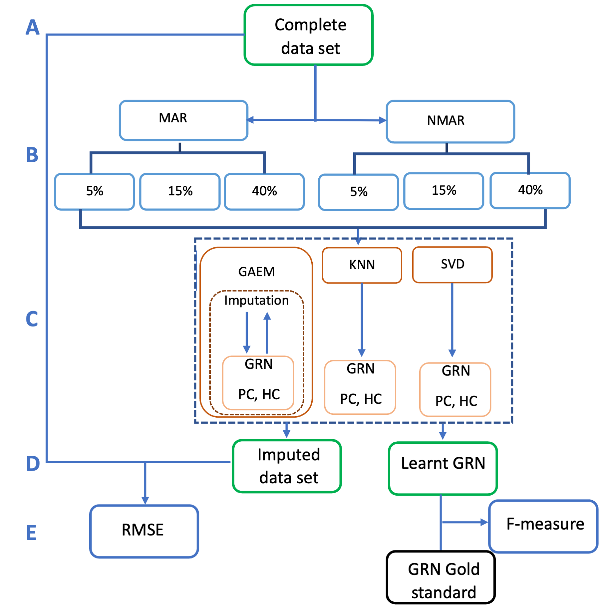

# GAEM: Genetic Algorithm Based Expectation Maximization For Inferring Gene Regulatory Networks From Incomplete Data



## Description

**GAEM** employs an iterative approach combining Genetic Algorithm and Expectation Maximization methodologies to infer GRN structures from incomplete data. This iterative process updates imputed values based on learned GRNs until convergence.  Part A presents the initial input, comprising the complete dataset. In Part B, datasets undergo artificial perturbation via Missing at Random (MAR) and Not Missing at Random (NMAR) mechanisms, each at 5%, 15%, and 40% missingness levels. Part C depicts the imputation process and learning of the directed structure of the Gene Regulatory Network (GRN) from incomplete datasets, employing the Singular Value Decomposition (SVD), k-Nearest Neighbors (KNN), and Genetic Algorithm Expectation-Maximization (GAEM) algorithms. Outputs are presented in Part D. Root Mean Square Error (RMSE) results are reported in Part E, with additional calculation of the F-measure if a Gold Standard GRN is available.

## Installation
```
install.packages("devtools")
# Install GAEM
devtools::install_github("parniSDU/GAEM")
```
#### Required Arguments (ordered)

1. Incomelte data set---> incom,<br>
2. Population size---> pSize,<br>
3. Thresold for Conditional Mutual Information---> lambda,<br>
4. Algorithm for directing the edges ---> mode= c("pc", "hc"),<br>
5. Score measure for structure building---> sco= c("loglik-g","aic-g","bic-g","pred-loglik-g","bge"),<br>
6. Probability of crossover---> pcross,<br>
7. Probability of mutation---> pmut,<br>
8. Maximum iteration for convergence---> maxiter, <br>
9. Error tollerance---> error <br>
- Notes:
  - The Incomelte data set is represented by matrix in txt format, where rows show the samples and columns show the genes.

#### Outputs: A list containing:

1. An imputed data set---> Best,<br>
2. A learnt GRN---> BestDag,<br>
3. Maximum fitness value---> MaxFit,<br>
4. Vector of fitness values---> FitVec

## Example
Examples of GAEM's usage DREAM3 size 10 can be found in the examples/ directory.
```


library(GAEM)
library(graph)
#Read the original data, missing data and gold-standard 
original<-read.table(file="examples/Dream10.txt", header=TRUE)
incomplete<-read.table(file="examples/DREAM10_MAR_10%.txt", header=TRUE)
gold_standard = read.csv(file="examples/true_10.csv", header=TRUE,row.names = 1)
gold_standard_graph<-as(as.matrix(gold_standard), "graphNEL")

#Run GAEM
result<-GAEM(incom= incomplete, pSize=10,  lamda=0.05, mode="pc", sco="bge",
             pcross=0.85,pmut=0.15,maxiter=50, error=0.00001 )

#Compare the imputed data set with the original data set, and the learnt GRN with the true GRN
cmp<-c(comp(gold_standard_graph, result$BestDag),RMSE=sqrt(mean(as.matrix((original-result$Best)^2))))
```

### Contributions, Questions, Issues, and Feedback

Users interested in expanding functionalities in GAEM are welcome to do so.Issues reports are encouraged through Github's [issue tracker](https://github.com/parniSDU/GAEM/issues).

### Citation

If you use GAEM in your work, we kindly ask that you cite the following paper:

```bibtex
@ARTICLE{Niloofar,
  title         = "GAEM: Genetic Algorithm Based Expectation-Maximization For Inferring Gene Regulatory Networks From Incomplete Data",
  author        = "Parisa Niloofar and  Rosa Aghdam and
                   Changiz Eslahchi",
  year          =  2024,
  archivePrefix = "arXiv"
}
```

